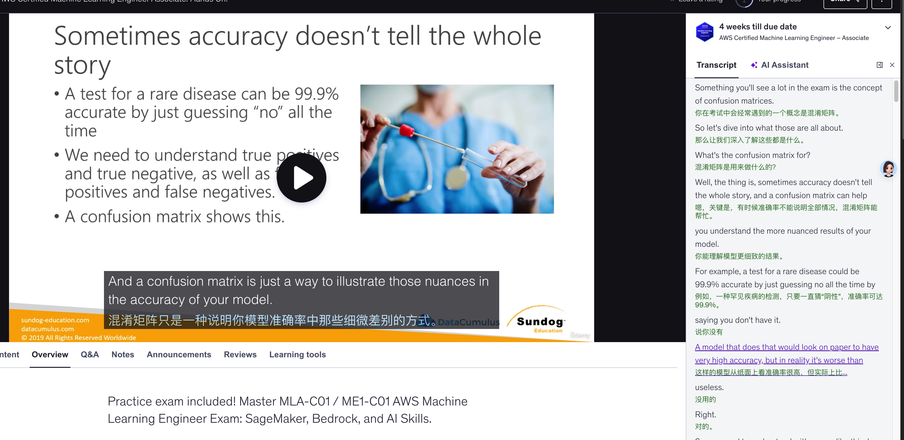

# Udemy Subtitle Translator Extension

This Chrome extension watches the Udemy video player for new subtitle lines, sends them to OpenAI for translation, and inlines the translated text on the page. It can optionally translate the transcript panel as you scroll.

## Features

- Real-time translation of the active subtitle cue displayed on the video (via the HTML5 text track API).
- Optional translation of the transcript list items.
- Toggle to hide/show the original subtitle text.
- Configurable target language, API base URL, model, concurrency, caption font size/color, and secure local storage for your OpenAI API key.
- 24-hour persistent translation cache to avoid re-paying for the same lines, with a one-click clear option.

## Setup

1. **Get an OpenAI API key** – visit the [OpenAI dashboard](https://platform.openai.com/) and create an API key with access to a translation-capable model (e.g., `gpt-4o-mini`).
2. **Load the extension**:
   - Open `chrome://extensions`.
   - Enable **Developer mode** (top-right).
   - Choose **Load unpacked** and select the `chrome-extension` folder from this repository.
3. **Configure**:
   - Click the extension icon or select **Details → Extension options**.
   - Paste your API key (stored locally), set the API base URL if you use a proxy/Azure endpoint, choose the model ID, adjust the concurrency limit, customise the caption font size and colour, pick a target language (default: `zh-CN`), and tweak the display toggles.

Once configured, open Udemy and start a video. The extension observes the subtitle area and transcript sidebar, translating new lines as they appear.

## Notes

- Translations are cached during the browsing session to avoid duplicate OpenAI requests.
- Captions are read from the video text track, so UI class changes on Udemy are less likely to break the integration. A custom overlay is rendered for the translated text.
- The extension respects Udemy's existing styling by appending translation nodes rather than replacing the original markup (the custom overlay only appears while using the track-based captions).
- Transcript history is sent as context so each caption gets translated with the previous few lines for coherence.
- Concurrent requests can be increased if you want faster pre-translation, but higher values are more likely to hit OpenAI rate limits.
- If subtitles stop translating, check the DevTools console for messages prefixed with `[Udemy Translator]`. Common causes are missing/invalid API keys or hitting OpenAI rate limits.
- Cached translations expire automatically after 24 hours; use the **Clear Translation Cache** button in the options page if you need to force a refresh sooner.

## Security

- Your API key is stored via `chrome.storage.local`, which stays on your machine and is never synced.
- All translation requests are sent directly from the background service worker to OpenAI over HTTPS.
